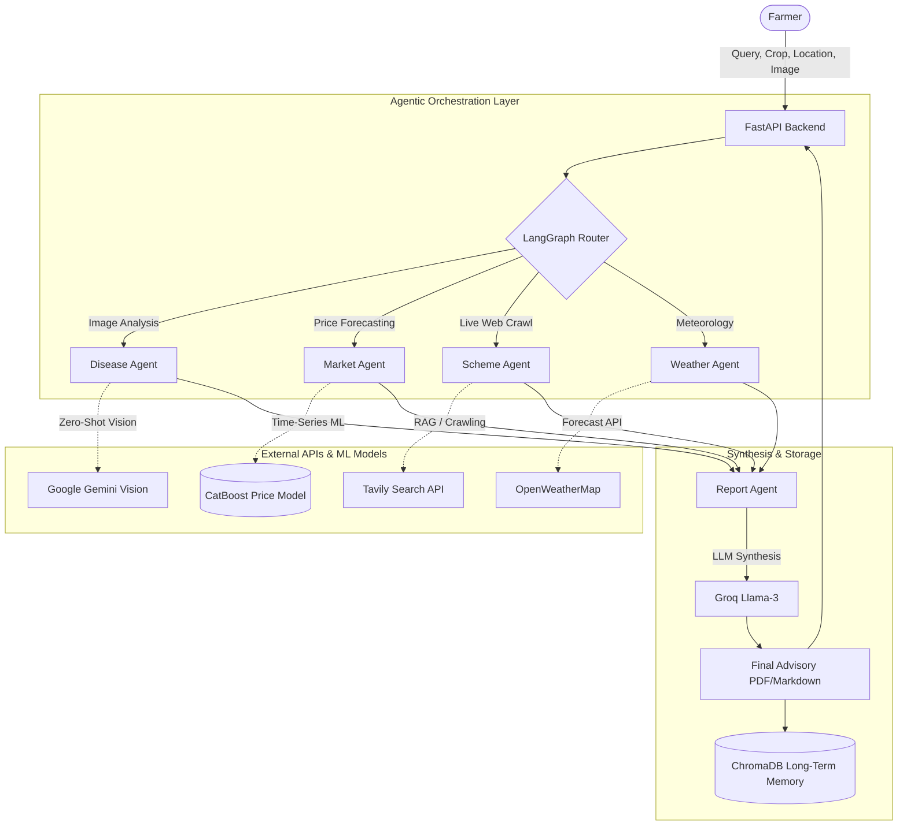

# 🌾 KisanMind — Intelligent AgriTech AI Assistant

KisanMind is a production-grade, multi-agent AI advisory system engineered specifically for Indian farmers. It leverages a parallelized **LangGraph** orchestration architecture, state-of-the-art **Retrieval-Augmented Generation (RAG)**, and advanced **Machine Learning** to democratize access to critical agricultural intelligence.

---

## 🎯 What We Solve

Indian agriculture suffers from severe information asymmetry. Farmers often lack access to timely, localized, and actionable data regarding crop diseases, volatile market prices, unpredictable weather patterns, and complex government subsidies. 

**KisanMind solves this by providing a unified, real-time intelligence hub:**
- **Instant Disease Diagnosis:** No need for expensive agronomists; farmers upload a photo and get instant multimodal diagnosis.
- **Predictive Market Intelligence:** We don't just show current prices; we use machine learning on historical data to predict where prices will be in 7 days, empowering farmers to decide *when* to sell.
- **Hyper-Local Policy Retrieval:** Government schemes change constantly. We crawl the web in real-time to match farmers with eligible subsidies.

---

## 🏗️ System Architecture

KisanMind is built on a highly scalable, asynchronous backend using **FastAPI**. It routes complex, multi-intent farmer queries to specialized autonomous agents that execute in parallel, aggregating their findings into a cohesive, localized report.



---

## 🧠 The 4 Specialized Agents

1. **🦠 Disease Agent (Multimodal AI):** 
   Utilizes Google's **Gemini Vision (zero-shot)** to diagnose crop diseases directly from uploaded photos. Bypasses the need for computationally heavy local CNNs while maintaining extreme accuracy on edge cases.
   
2. **📈 Market Agent (Time-Series ML):** 
   Powered by a custom **CatBoost Regressor** trained on a **97MB AGMARKNET historical dataset**. We engineered complex time-series features (lags, rolling means, volatility) to achieve a mathematically validated **0.833 R² score** for 7-day crop price forecasting.

3. **🏛️ Scheme Agent (Live RAG):** 
   Integrates with the **Tavily Search API** to autonomously crawl government portals in real-time, matching farmers with active subsidies (like PM-KISAN) based on their crop and geolocation.

4. **🌤️ Weather Agent (Live Telemetry):** 
   Connects to **OpenWeatherMap** to pull hyper-local, real-time 5-day forecasts, generating actionable advice on when to irrigate or spray pesticides.

---

## 🚀 Performance Metrics

By executing our 4 autonomous agents **in parallel** rather than sequentially, the LangGraph orchestrator achieves a massive reduction in latency. In benchmark testing, parallel execution dropped response times from **~22 seconds to ~12.5 seconds (a 42% latency reduction)**, ensuring farmers aren't left waiting on slow connections.

---

## 💻 Getting Started

### 1. Environment Setup
The backend runs on Python 3.11+. 

```bash
cd Backend
source .venv/bin/activate
pip install -r requirements.txt
```

### 2. API Keys
Create a `.env` file in the `Backend/` folder with the following keys:
```env
# Essential LLM & Vision
LLM_PROVIDER=groq
LLM_API_KEY=your_groq_key
GEMINI_API_KEY=your_gemini_key

# External Tools
TAVILY_API_KEY=your_tavily_key
OPENWEATHERMAP_API_KEY=your_owm_key
```

### 3. Running the Server
Launch the FastAPI backend:
```bash
cd Backend
uvicorn main:app --reload --port 8000
```
The API will be available at `http://localhost:8000`. You can test the endpoints interactively via the Swagger UI at `http://localhost:8000/docs`.
